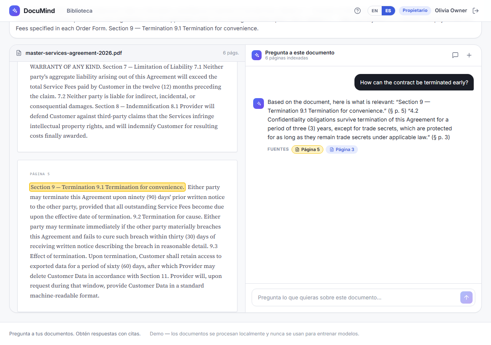
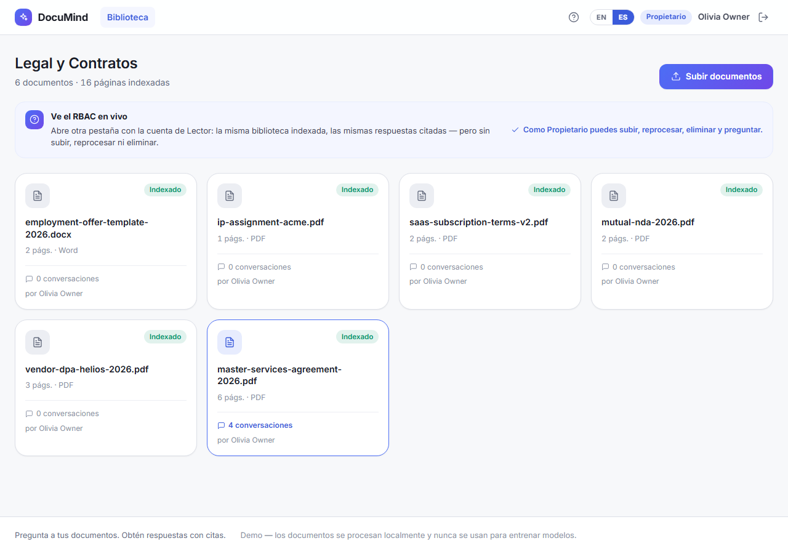
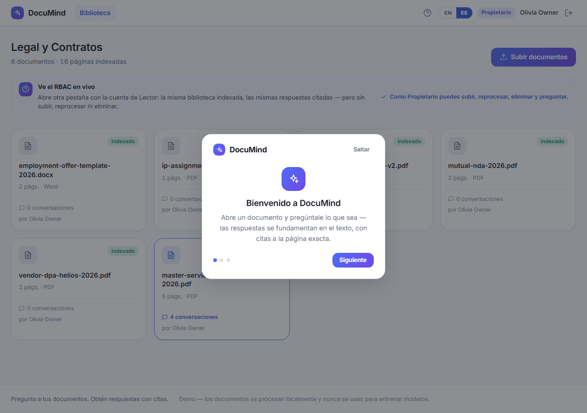

# DocuMind — AI document assistant (RAG)

Upload a contract, ask it in plain language, and get answers **grounded in the text with citations to the exact page**. DocuMind is an end-to-end **retrieval-augmented-generation** pipeline — local embeddings, a real `pgvector` store, streamed answers, and verifiable citations — that runs a full live demo **without depending on any paid API**.

**[▶ Live demo](https://luisgxz.github.io/DocuMind)** · **[About / technical write-up](https://luisgxz.github.io/DocuMind/about)**

Demo accounts — `owner@documind.dev / Owner1234!` (Owner) · `viewer@documind.dev / Viewer1234!` (Viewer)



---

## What it does

- **Upload** PDF / TXT / Markdown → asynchronous ingestion with live progress.
- **Ask** in natural language → semantic retrieval over the document (pgvector cosine, HNSW index) → a streamed answer.
- **Citations** to the exact page — hover one to highlight the source passage in the reader.
- **Conversations** per document, with history and auto-generated summaries.
- **RBAC** — Owners upload, reprocess, delete and ask; Viewers read and ask.
- **Bilingual** (EN/ES) throughout, with a role-aware guided tour.

## Stack

| Layer | Tech |
|-------|------|
| Frontend | Angular 20 (standalone + signals), SCSS design system, SSE streaming via `fetch` |
| Backend | NestJS (Node), Prisma 6, class-validator, JWT + argon2 |
| Vector store | Postgres + **pgvector** (`vector(384)`, HNSW, raw-SQL `<=>` retrieval) |
| Embeddings | Local ONNX `all-MiniLM-L6-v2` via `transformers.js` (key-free, 384-dim) |
| Generation | `AnswerGenerator` interface — deterministic **extractive** default + **Claude** adapter (`@anthropic-ai/sdk`, activates with `ANTHROPIC_API_KEY`) |
| Deploy | API on Azure App Service · DB on Neon (serverless Postgres) · Front on GitHub Pages |

## Architecture

```
Angular SPA  ──HTTP/JWT──▶  NestJS API
  split-view reader + chat       │
        ▲   SSE (tokens)         ├─ auth        JWT access + rotating refresh, argon2, lockout, RBAC guards
        │                        ├─ documents   upload, library, status/progress, reprocess, delete
        └────────────────────────┤  ingestion   extract → chunk (page-preserving) → embed → store vector(384)
                                  ├─ embeddings  ONNX all-MiniLM (local, 384-dim, normalized)
                                  ├─ rag         retrieval (pgvector top-k <=>) + AnswerGenerator + SSE
                                  └─ Postgres + pgvector  (HNSW index, raw-SQL cosine)
```

The chat streams over Server-Sent Events; every answer is stitched from passages that actually appear in the retrieved chunks, each tagged with a `(§ p. N)` citation persisted alongside the message.

## Run locally

**Prerequisites:** Node 20+, Docker (for Postgres + pgvector).

```bash
# 1. Database (Postgres 17 + pgvector on :5434)
docker compose up -d

# 2. Backend
cd backend
npm install
cp .env.example .env            # adjust if needed
npx prisma migrate deploy
npm run seed                    # demo workspace + users + legal corpus
npm run start:dev               # http://localhost:3000

# 3. Frontend
cd ../frontend
npm install
npm start                       # http://localhost:4200
```

By default (no `ANTHROPIC_API_KEY`) the API runs the **deterministic extractive generator** — real retrieval, real citations, real streaming, zero cost. Set `ANTHROPIC_API_KEY` to switch the same pipeline to Claude.

## Tests

```bash
cd backend && npm test          # 50 tests — chunker, cosine, auth, RBAC, extractive generator
```

The frontend is verified end-to-end with Playwright across three breakpoints (login, chat streaming with citations, RBAC, and a real upload→index→ask flow).

## Screenshots

| Library | Reader + chat | Guided tour |
|---|---|---|
|  |  |  |

More detail in **[docs/TECHNICAL.md](docs/TECHNICAL.md)**.

---

Built by **Luis Chiquito Vera** — part of a 14-project portfolio. The deeper design rationale lives in the in-app [About page](https://luisgxz.github.io/DocuMind/about).
